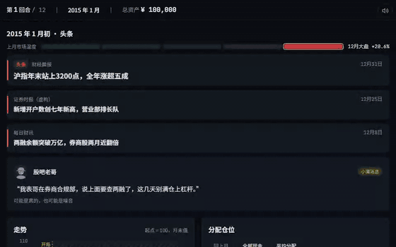
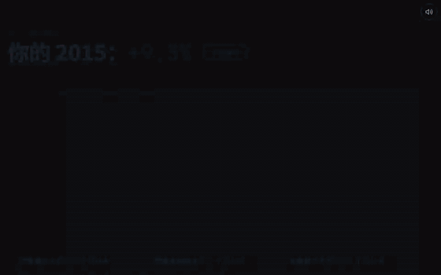
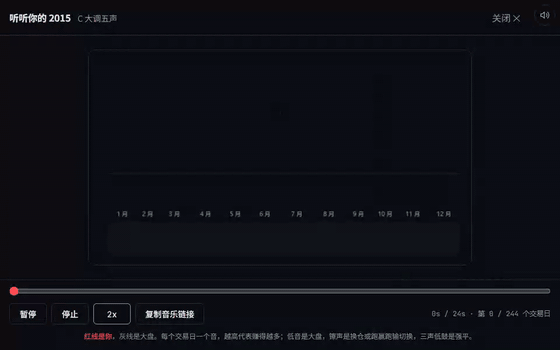
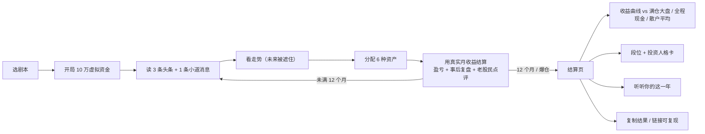
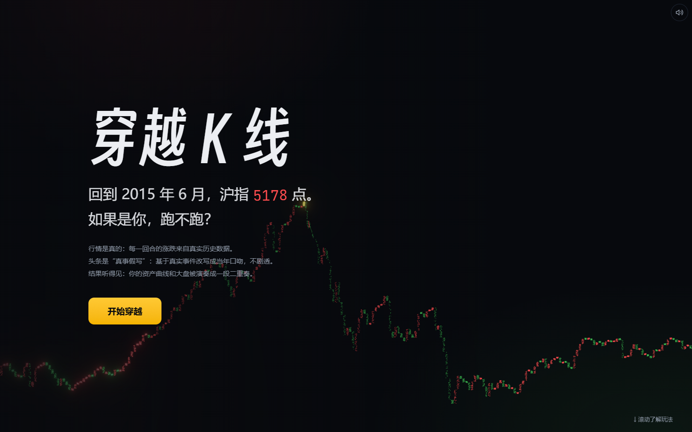
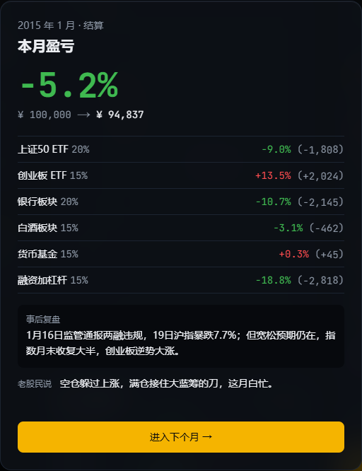
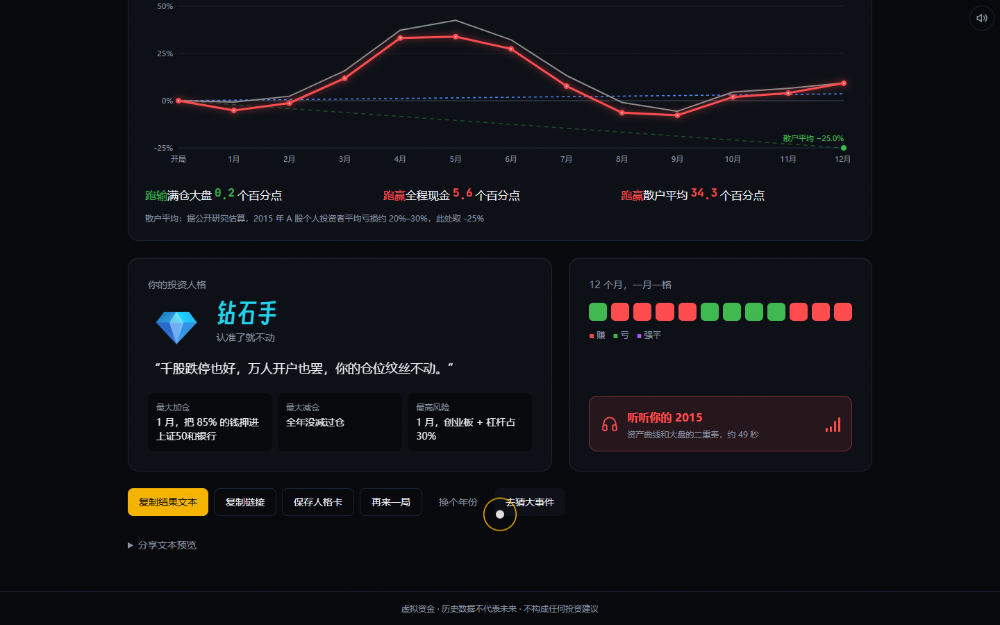

# 穿越 K 线 · kline-replay

穿越回 2015 年，每月读真实事件改写的头条、分配虚拟仓位，12 回合后结算出投资人格卡，并把你这一年的资产曲线和大盘曲线演奏成一段二重奏。

1. **行情是真的**：每一回合的涨跌来自真实历史数据，每个选择都有真实后果。
2. **头条是"真事假写"**：AI 基于真实事件生成当年口吻的新闻，不剧透，玩家自己分辨信号与噪音。
3. **结果听得见**：你的资产曲线和大盘曲线被演奏成一段二重奏，和人格卡一起分享。

线上地址：**https://kline-replay.vercel.app**（部署步骤见 [DEPLOY.md](DEPLOY.md)） · 剧本（六个年份）：2007 大牛市、2008 金融海啸、2015 疯牛与股灾、2018 贸易战熊市、2020 疫情与核心资产、2024「924」行情 · 新玩法：大事件猜涨跌





## 玩法



- 每个回合的头条只写**回合开始时已经发生**的事（第 N 回合看的是上个月的新闻），结算后才揭晓本月复盘。
- 小道消息 12 条里 6 条暗示本月真实方向（说得像吹牛），6 条是纯噪音。
- 融资加杠杆 = 2 倍做多上证 50，年息 8.4%，当月亏 50% 强平归零。
- 结果链接 `/result?s=2015.xxxx` 只编码 12 个月的仓位（62 字符 + 校验字节），结算页每次都从链接重新计算，任何人打开看到的数字一致，篡改任意字符都会被识别为无效链接。

## 第二种玩法：大事件猜涨跌（`/events`）

3 分钟一局：从题库里随机抽 10 张历史事件卡（A 股经典时刻 23 张、全球黑天鹅 16 张，共 39 张已核实），每张给出事件日、背景和事发前 60 个交易日的真实走势，猜**事件日之后 20 个交易日是涨还是跌**。

- 计分：方向对 +10；进阶模式再猜幅度（<−10% / −10~−3% / ±3% / 3~10% / >10%），档对 +5；连对 3 张起每张再 +2。普通模式满分 116，进阶 166。
- 揭晓：曲线从事件日起逐日生长，20 个交易日对应 20 个音（涨为大调、跌为小调），再告诉你「当时发生了什么」。
- 结算：称号（市场先知 / 老江湖 / 有点感觉 / 随机漫步 / 反向指标）、每张卡的对错、战绩卡。战绩链接只有 30 个字符，结算页从链接重算，篡改会被识别。
- 题库在 [`content/events/`](content/events/) 里，只写文字；走势由 `content/data/prices/market_long.json`（上证综指 1990–）和 `spx_long.json`（标普 500 1927–）按日期切片。`python scripts/validate_events.py` 会检查日期是否交易日、前后数据是否齐全、文中引用的涨跌幅是否与行情一致、题库涨跌是否失衡。
- 20 个交易日涨跌幅不足 1% 的事件（答案接近平盘）不进题库，标记 `verify: false`。

## 历史时刻

主游戏里，剧本标记的关键日期（2007：2 月 27 日暴跌、5 月 30 日印花税、10 月 16 日 6124 点；2008：4 月 24 日印花税下调、9 月 19 日三大利好、11 月 10 日四万亿；2015：1 月 19 日两融暴跌、6 月 12 日 5178 点、8 月 24 日黑色星期一；2018：3 月 23 日贸易摩擦、6 月 19 日失守 3000 点、10 月 19 日一行两会发声；2020：2 月 3 日、7 月 6 日；2024：1 月 22 日 2756 点、8 月末成交跌破 5000 亿、9 月 30 日 2.6 万亿成交）会在**下一个回合开始前**插入一张全屏报纸风卡片，选项只是预填本月仓位（减半仓 / 不动 / 加杠杆），之后仍可自由调整，不改变结算规则，所以结果链接的复现不受影响。

## 数据来源与免责声明

| 资产 | 序列 | 实际数据源（2015 / 2020） |
|---|---|---|
| 上证50 ETF | 510050 前复权 | akshare `fund_etf_hist_em`（东方财富） |
| 创业板 ETF | 159915 前复权 | akshare `fund_etf_hist_em`（东方财富） |
| 银行板块 | 中证银行 399986 | akshare `stock_zh_index_hist_csindex`（中证指数官网，东方财富接口不通时的备选） |
| 白酒板块 | 中证白酒 399997 | akshare `stock_zh_index_hist_csindex`（同上） |
| 大盘基准 | 上证综指 000001 | akshare `stock_zh_index_daily`（新浪，备选） |
| 货币基金 | — | 固定月收益：2007 年 0.2%，2008 年 0.25%，2015 年 0.3%，2018 年 0.3%，2020 年 0.2%，2024 年 0.15% |
| 2007 / 2008 的替代 | 中小板 ETF 159902；贵州茅台 600519 前复权 | 当年还没有创业板和白酒指数；新浪 `fund_etf_hist_sina` / `stock_zh_a_daily`。茅台停牌日按「当天不变」补齐（build_script.py 以上证综指的交易日为日历） |
| 2007–2024 新增年份的上证50 / 创业板 | 上证50 指数 000016；创业板指 399006 | 东方财富接口不通时用新浪指数（不含分红，与 ETF 相差很小），资产名称写的是指数 |
| 加杠杆 | 2 倍做多上证50 | 融资年息：2015 / 2018 / 2020 年 8.4%，2024 年约 6%；2007 / 2008 年没有融资融券，按场外配资月息约 1% |
| 事件模式：上证综指全量 | 000001 | akshare `stock_zh_index_daily`（新浪），1990-12 至今 |
| 事件模式：标普 500 全量 | ^GSPC | Yahoo Finance chart 公开接口（1927 至今；akshare 新浪源只有 2004 年起，作为备选） |

每个文件的来源、行数、首末日期、是否启用备选都记录在 [`content/data/manifest.json`](content/data/manifest.json)。2015 年上证综指逐月收益与规格附录 B 的参考值全部吻合。

散户平均收益：2015 年取 −25%（公开研究估算的 −20%～−30% 区间中值）；2020 年缺少权威统计，粗估取 +5%；2008 年按新浪财经年末调查（82.56% 亏损、多数亏 20%–70%）取 −50%；2007、2018、2024 年都是粗估（+50%、−30%、0%），页面上有注明。

宏观与资金面数据（东方财富数据中心）从 2008 年 1 月起才有：2007 年只有 PPI，2008 年开头几个回合数据较少；融资融券 2010 年才开通，所以 2007、2008 年没有两融余额。

事件时间线参考维基百科等公开资料，见 [`scripts/timelines/`](scripts/timelines/)。

> 本游戏全部使用虚拟资金，仅用于娱乐和了解历史。历史行情不代表未来表现，游戏内的头条、小道消息、点评和人格评语都不构成任何投资建议。

## 人格判定规则

从上到下依次判定，命中即停。`highRisk = 创业板 + 融资杠杆`，`peakMonth / troughMonth` 是上证综指月末收盘最高 / 最低的月份（2015 为 5 月 / 9 月）。

| 人格 | 规则 |
|---|---|
| 🎢 杠杆狂人 | 融资加杠杆 ≥ 30% 的月份 ≥ 4 个 |
| 🪂 逃顶大师 | peakMonth ± 1 内某月 highRisk ≤ 20，且前一月 ≥ 40 |
| 🎯 抄底猎人 | troughMonth 当月或下月 highRisk 比前一月增加 ≥ 30 |
| 🏄 追涨型冒险家 | 大盘连涨 2 个月后的下一月 highRisk 增加 ≥ 20，出现 ≥ 2 次 |
| 🐦 惊弓之鸟 | 某月亏损后下一月货币基金 ≥ 60%，出现 ≥ 2 次 |
| 💎 钻石手 | 每月换手幅度 Σ\|Δ\|/2 都 ≤ 10 |
| 🌊 随波逐流者 | 默认 |

## 音乐映射规则

| 元素 | 数据 | 规则 |
|---|---|---|
| 主旋律 | 你的日度资产曲线 | 每个交易日一个音，Tone.js `PolySynth` 三角波 |
| 音阶 | 全年终值 | 赚钱 C 大调五声 C3–A5，亏钱 A 小调五声 A2–G5 |
| 音高 | 累计收益 d | d ∈ [−50%, +50%] → 音阶索引 [0, 14]；单日 > +3% 升一级，< −3% 降一级 |
| 力度 | 单日收益 | \|r\| ∈ [0, 5%] → [0.4, 1.0] |
| 低音 | 上证综指 | `MonoSynth`，每 5 个交易日一个音，低两个八度 |
| 镲 | 换仓 / 跑赢跑输切换 | 换仓月首日 0.6；你和大盘曲线交叉 0.4 |
| 低鼓 | 大跌 / 强平 | 单日 ≤ −5% 一声；强平日 C1 三连击 + 画面闪红 |
| 装饰音 | 大涨 | 单日 ≥ +5% 加高八度 |
| 速度 | — | 每音 0.2 s，约 49 s 一年，可切 2x |

画面是 16:9 Canvas：红线是你、灰线是大盘，从左向右生长；每个音一个涟漪，月份虚线、换仓标记、底部 30 格钢琴卷帘，播完定格"你的 2015 · 跑赢大盘 X 个百分点"。

## 阅读设置：三套主题、字体、复盘文风（v4）

右上角 **Aa** 打开「阅读设置」（二级抽屉：第一层是主题、字号、行距、玻璃质感；字体和复盘文风各有一个第二层，放样张）。只存在本机 `localStorage["kline:prefs"]`，`<head>` 里的小脚本在首帧前生效，切到浅色主题不会先闪一下深色。

| 主题 | 给谁 | 特征 | 默认字体 | 默认复盘文风 |
|---|---|---|---|---|
| 盘口（默认） | 专业玩家 | 原来的深夜盘口配色；游戏页多一块**工作台**：风险敞口、有效杠杆、「重演上月」压力测试、6 项真实宏观与资金面数据 | 系统黑体 + JetBrains Mono | 研报：结论一行 + 收益归因表（各资产贡献多少个百分点）+ 风险敞口变化 + 月内最大回撤；年终页出年度指标（最大回撤、胜率、年化波动、夏普、平均敞口） |
| 纸面 | 一般玩家 | 借鉴「见微」的纸面编辑部：暖白纸、墨色正文、靛蓝交互、思源宋体标题；首页首屏是 2015 年沪指的一笔墨线 | 系统黑体 | 标准：原来的「事后复盘 + 老股民说」 |
| 简约 | 轻松玩 | 只留头条、走势和仓位（温度计、已知信息收起），楷体、留白大 | 霞鹜文楷 | 白话：一句话说清赚亏和比大盘如何、谁帮忙谁拖后腿、下个月可以想想的事 |

- **字体**：系统黑体（低分屏最清楚，数字密集的盘面首选）、思源宋体 Noto Serif SC（长段复盘最耐读）、霞鹜文楷屏幕版（亲切，屏幕版加粗了笔画），都是 OFL。`scripts/build_body_fonts.py` 把后两种裁剪到站内实际用到的字（文楷 279 KB、宋体 200 KB），只有选中时才下载。字号 90%–130%，只放大游戏和结算页，页头按钮不动。
- **复盘文风**不新增判断：白话与研报的每个数字都由当月真实行情和玩家当时的仓位算出（`src/lib/voice.ts`），测试里核对「各资产贡献之和 = 当月盈亏」。
- **宏观与资金面**（`content/data/macro.json`，`node scripts/fetch_macro.mjs` 更新）：制造业 PMI、CPI、PPI、M2、两融余额、新增投资者，来自东方财富数据中心（统计局、人民银行、交易所、中国结算的公开数据）。**按发布日期处理，不剧透**：每回合开始时只显示当时已经公布的月份——PMI 与月末两融余额滞后 1 个月，CPI / PPI / M2 / 新增投资者滞后 2 个月，测试逐回合检查。
- **液态玻璃**（照 Apple Liquid Glass 的三层做，不是在按钮外画一圈彩虹）：①**透镜**——边缘像一圈凸透镜，把背后的内容放大、弯进来，所以边上看到的颜色就是背后内容自己的颜色；`src/components/shell/lens.ts` 按每个控件的宽、高、圆角生成一张位移贴图（边缘最强、中间为零，红绿蓝位移差 12% 带一点色散），Chromium 用 `backdrop-filter: url()` 渲染；②**镜面高光**——一道白光沿边缘走，朝向跟着光标（桌面），对边有一道弱反光；③**发光**——按下时从按的位置由内向外亮起，140 px 内的其他玻璃也跟着亮，控件轻微鼓起。四档：清透（默认，带一层压暗保证文字可读）/ 着色 / 磨砂 / 关闭，对应 iOS 26.1 的「清透 / 着色」。玻璃只用在浮在内容上面的控件层（顶部状态栏、右上角按钮、放大镜、声音提示），正文和数据卡保持实底。贴图在主线程空闲时才生成。
- **更多设置**：涨跌颜色（红涨绿跌 / 绿涨红跌，图表和温度计一起换）、盘口强调色（琥珀金 / 冰川蓝 / 暮光紫）、数据放大镜开关、动效（完整 / 减少，与系统「减少动态效果」等效）。
- **阅读顺序**：游戏页三栏各有步骤标签「1 看消息 → 2 看数据 → 3 做决定」，手机上从上到下同样顺序；状态栏改成浮起的玻璃条，左边「在哪」（回合、日期、12 格进度），右边「怎么样」（上月、累计、总资产），标签在上、数值在下。
- **借鉴见微**：「历史位置」——每个宏观数值后面标出它在最近 12 个已公布月份里偏高 / 偏低 / 最高 / 最低；「本月日程」（见微的「下次验证」）——工作台和宏观抽屉列出这个月会公布哪些数据、大概哪天，数值要到下个回合才出现；研报体结算多一行「下月跟踪」。
- **数据放大镜**：有精确指针的设备上，光标停在关键数字（总资产、上月盈亏、已知信息涨跌、工作台指标、年度指标、跑赢跑输）上，数字弹性放大，旁边浮出玻璃透镜放大显示数值和名称。结算弹窗在浏览器顶层，透镜盖不上去，所以弹窗里没有。

## 动效层（v5）

从两套成熟的开源组件库里挑效果，按本项目的规矩改成大多是纯 CSS 的实现（`src/app/motion.css`、`src/components/shell/Interact.tsx`、`src/lib/celebrate.ts`，出处和许可证见 `THIRD_PARTY_NOTICES.md`）：

| 效果 | 参考 | 用在哪 |
|---|---|---|
| 聚光卡片 | Magic UI · Magic Card | 所有面板和头条卡：光标所在处一团柔光，边框亮起一段 |
| 点阵底纹 | Magic UI · Dot Pattern | 盘面空白处的淡点阵，光标附近的点亮起来（简约主题不显示） |
| 边框流光 | Magic UI · Border Beam | 「进入下个月」和首页「开始穿越」：一道光沿边框跑，提示下一步 |
| 斜光扫过 / 按压回弹 | Magic UI · Shimmer Button | 主按钮悬停扫光；所有按钮按下去有「压下去」的手感 |
| 逐字显影 | Motion Primitives · Text Effect + Magic UI · Blur Fade | 每个月的头条一字一字从模糊变清楚 |
| 文字流光 | Motion Primitives · Text Shimmer | 「结算中」 |
| 滑动选中块 | Motion Primitives · Animated Background | 设置里的分段按钮，选中块滑过去 |
| 列表依次进入 | Magic UI · Animated List | 研报体结算的归因表、设置抽屉的各行 |
| 彩带 | Magic UI · Confetti（canvas-confetti） | 单月赚 6% 以上从大数字处喷一次；全年跑赢大盘两侧礼炮一次 |

另外：仓位滑条拖动时拇指外圈发光、上方浮出数值；「分配仓位」右上角的风险构成环随拖动实时变形，中间是合计（不到 100% 显示红色）；已知信息的涨跌条每月从中线长出来；状态栏当前月的进度格呼吸，换月时一道光扫过整条。

规矩：内容永远不从完全透明开始（换月闪白、弹窗隐身都吃过亏）；触屏不开光标类效果；系统或设置里「减少动效」时全部静止；彩带库只在触发时才下载。

## 技术栈与架构

Next.js 15（App Router）· React 19 · TypeScript · Tailwind CSS v4 · Zustand（persist 到 localStorage）· Recharts · Tone.js 15 · html-to-image · Supabase（可选）· DeepSeek（可选）· Vitest · Playwright · Python + akshare（仅开发期数据管线）

```mermaid
flowchart TB
  subgraph dev[开发期 · scripts/]
    F[fetch_prices.py<br/>akshare 多源回退] --> P[(content/data/prices)]
    T[timelines/*.md] --> G[gen_headlines.py / 人工撰写] --> H[*.headlines.json 审核版]
    P & H --> B[build_script.py] --> S[(content/scripts/2015.json)]
    B --> V[validate_script.py]
  end
  subgraph run[运行期 · src/]
    S --> E[game/engine.ts<br/>settle · simulateDaily · benchmarks · rank]
    E --> PS[game/persona.ts]
    E --> ST[game/store.ts] --> UI[/play/[script]/]
    E --> EN[game/encode.ts] --> R[/result?s=/]
    E --> M[music/compose → player(Tone) → visual(Canvas)]
    R --> OG[/api/og]
    UI --> CM[/api/comment<br/>DeepSeek 1.5s，超时走模板]
    R --> BD[/api/board<br/>Supabase，服务端重算]
  end
```

运行时只读仓库里的 JSON，不依赖外部接口；点评和排行榜都有兜底，环境变量全空也能完整玩一局。

## 本地运行

```bash
npm install
npm run dev          # http://localhost:3000
```

可选环境变量见 [`.env.example`](.env.example)：`DEEPSEEK_API_KEY`（事后点评走 LLM，缺省用模板）、`SUPABASE_URL` + `SUPABASE_ANON_KEY`（排行榜，建表 SQL 在 [`supabase/schema.sql`](supabase/schema.sql)）。

检查命令：

```bash
npm run lint
npm run test         # Vitest：引擎 / 人格 / 编码 / 作曲 / 事件模式 / 历史时刻
npm run build
npm run e2e          # Playwright：完整一局 + 分享 + 音乐 + 历史时刻 + 事件模式；本机用系统 Chrome，CI 用 /opt/pw-browsers/chromium（可用 PW_CHROMIUM 覆盖）
npm run cli          # 命令行按附录 B 固定操作跑一局
```

重建数据（可选，仓库已带好数据）：

```bash
python -m venv .venv && .venv/Scripts/pip install -r scripts/requirements.txt   # macOS/Linux 用 .venv/bin/pip
.venv/Scripts/python scripts/fetch_prices.py 2007 2008 2015 2018 2020 2024
for y in 2007 2008 2015 2018 2020 2024; do .venv/Scripts/python scripts/build_script.py $y; done
node scripts/fetch_macro.mjs
python scripts/build_hero_data.py   # 首页剧本卡的小走势线
```

加一个新年份：写 `scripts/timelines/<年>.headlines.json`（格式照现有几份：每月 3 条头条、1 条小道消息、1 句事后复盘，全年 3 张历史时刻卡，12 条小道消息里 6 条是真信号），抓价格、构建（`validate_script.py` 会检查字数、不剧透、结构），再在 `src/lib/scripts.ts` 和首页 `ScriptCards.tsx` 登记。

## AI 工具使用说明

- **AI 生成的代码**：数据管线（fetch / build / validate / gen_headlines）、游戏引擎与测试、人格判定、URL 编码、全部页面与组件、音乐作曲 / 调度 / 可视化、API 路由、e2e 用例——由 Claude Code（Claude Opus）按规格书逐任务生成。
- **AI 生成的内容**：六个年份共 72 个月的头条、小道消息、事后复盘（事件日期对照公开报道核对，复盘里的涨跌幅全部来自价格数据）；7 种人格的称号与评语；12 类 × 4 条事后点评模板。运行时的事后点评在配置了 DeepSeek 时由 LLM 实时生成。
- **人（与规则）做了什么**：规格书与玩法设计；事件时间线核对；头条按审核清单（不剧透、无人名、无点位预测、无买卖建议、字数上限）把关，字数与结构由 `validate_script.py` 机检；所有行情数字只来自数据脚本，不手写。
- 开发过程的每一步决策见 [`DECISIONS.md`](DECISIONS.md)，日志见 [`DEVLOG.md`](DEVLOG.md)。

## 后续计划

- 音乐导出视频
- 双人对战：同一剧本、同一时间线、实时比收益
- 更多想法见 [`IDEAS.md`](IDEAS.md)

## v2 变更日志（2026-09-29）

- 修复：音乐播放时的 Tone.js 异常；定格文案与换仓标签重叠；GitHub 链接改读环境变量。
- 游戏页：第 1 回合走势图带开局前两个月；头条卡有语气色条、虚构媒体、日期戳和「头条」标签，顶部有上月市场温度计；新增「本月已知信息」卡；手机端紧凑状态栏；资产说明「?」；输入框内 Enter 提交。
- 结算页：图例「你」排第一；散户平均改为端点标注；tooltip 显示当月仓位；强平月标记；关键操作文案改人话；音乐链接 `?play=1`。
- 音乐：竖屏 9:16 画面；全站静音开关（记住选择）；强平局 2x 播放 0 错误。
- OG 图：中文字体子集随仓库打包，断网也出中文。
- 新增：大事件猜涨跌模式、历史时刻插卡、三段 GIF、演示视频原始素材脚本（`scripts/record_demo.mjs`）。

## v3 前端包装（2026-09-29）

设计概念「深夜盘口 · 档案馆」：冷的终端（等宽数字、K 线、红绿光）× 暖的档案（报纸、纸张、打字机）。规则、数据和链接编码没有改。





- **首页**：2015 年 244 根上证日 K 变成粒子，飞入成走势轮廓，鼠标会推开粒子；5178 翻牌与飞入同时结束；三段滚动叙事；剧本卡倾斜、卡片转场；跑马灯。低端设备 / 减弱动效 / 无 WebGL 时自动换成静态图。
- **游戏**：纸色档案 Intro、翻页进入；阻尼滑块每跨一档有 tick 与震动；「结算中…」→ 月份翻牌 → 结算对话框从按钮放大，盈亏数字翻牌落定；强平有整页震动、红暗角、信号干扰和低鼓。
- **结算**：翻牌收益、段位盖章、四条线依次绘制、人格卡 3D 翻转；音乐弹窗背景随音符发光。
- **声音**：6 个 UI 音效共 12 KB，首次访问有「开启声音」提示；右上角喇叭可关，同一音效 80 ms 内不重复。
- **降级**：`prefers-reduced-motion`、省电模式、触屏、无 WebGL、页面不可见各有测试（`e2e/degrade.spec.ts`）。

新增命令：

```bash
npm run perf                          # Lighthouse：首页 / 游戏 / 结算 × 桌面 / 手机（4G），对照方案 7.1 预算
node scripts/analyze_trace.mjs        # 4 倍降速下的帧耗时统计
node scripts/record_showreel.mjs      # 录展示视频（需要 Playwright 自带 ffmpeg）
python scripts/build_fonts.py         # 重新生成得意黑子集
node scripts/render_sfx.mjs           # 重新合成 6 个音效
```
